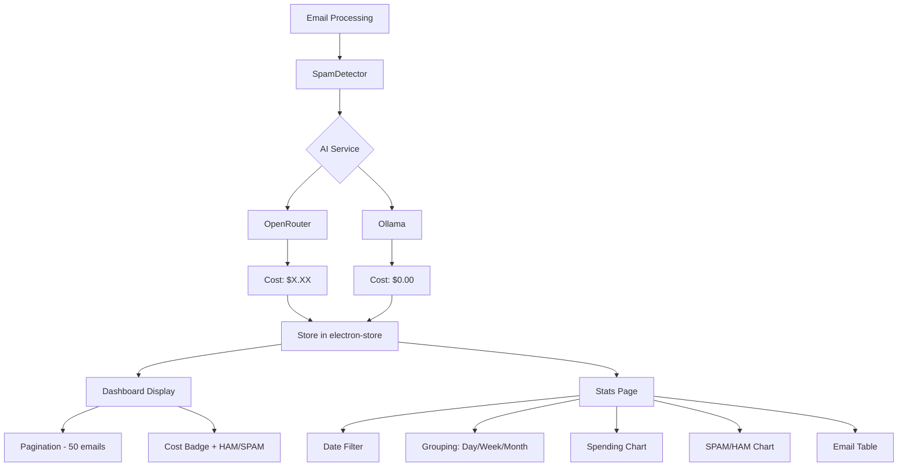

# Implementation Plan: AI Cost Display & Stats Page

## Overview
This plan outlines the implementation of AI cost tracking for analyzed emails and the creation of a comprehensive Stats page.

## Requirements Summary
- Display AI cost (USD) on dashboard before HAM/SPAM badge
- Create new Stats page with spending and SPAM/HAM charts
- Date filter: Today, Last 7 days, Last 30 days, Custom range
- Grouping: Day, Week, Month
- Pagination on dashboard (50 emails per page)
- Remove 50-email storage limit (store unlimited)

## Architecture Diagram



## Implementation Steps

### Step 1: Update OpenRouter Service to Capture Cost
**File:** `lib/ai/openrouter.ts`

**Changes:**
1. Modify `sendMessage` to parse cost from OpenRouter API response
2. OpenRouter returns cost in `data.usage.total_cost` field
3. Return an object with both message and cost

**New interface:**
```typescript
interface AIResponse {
  content: string;
  cost: number; // USD amount
}
```

### Step 2: Update AIService Interface
**File:** `lib/ai/types.ts`

**Changes:**
1. Modify `sendMessage` return type to include cost
2. Update both OpenRouter and Ollama implementations

### Step 3: Update EmailProcessor to Store Cost
**File:** `lib/ai/emailProcessor.ts`

**Changes:**
1. Capture cost from AI service response
2. Include cost in analyzed email data when saving
3. Pass cost to `window.analyzedEmailsAPI.create`

### Step 4: Update AnalyzedEmail Type Interface
**File:** `app/page.tsx`

**Changes:**
```typescript
interface AnalyzedEmail {
  // ... existing fields
  cost?: number; // USD cost, undefined for Ollama or existing emails
  aiProvider?: 'openrouter' | 'ollama';
}
```

### Step 5: Remove 50-Email Limit
**File:** `main/accountsManager.js`

**Changes:**
- Remove lines 176-179 (the limit logic)
- Store unlimited analyzed emails

### Step 6: Add Pagination to Dashboard
**File:** `app/page.tsx`

**Changes:**
1. Add state for current page and page size (50)
2. Calculate paginated emails using `slice`
3. Add Previous/Next page buttons
4. Show "Page X of Y" indicator

### Step 7: Display Cost Badge on Dashboard
**File:** `app/page.tsx`

**Changes:**
1. Add cost display before HAM/SPAM badge in AccordionTrigger
2. Show "$0.00" for Ollama or missing cost
3. Use muted color for cost text

**UI Layout:**
```
[Subject]                 [$0.0012] [SPAM (8/10)]
```

### Step 8: Create Stats Page
**File:** `app/stats/page.tsx`

**Components:**
1. **Date Filter:**
   - Today
   - Last 7 days
   - Last 30 days
   - Custom date range (start/end date pickers)

2. **Grouping Selector:**
   - Day
   - Week
   - Month

3. **Spending Chart:**
   - Line/bar chart showing total cost over time
   - X-axis: Time period
   - Y-axis: USD amount

4. **SPAM/HAM Chart:**
   - Bar chart showing email classification counts
   - Stacked or grouped by SPAM/HAM

5. **Email Table:**
   - All emails within filtered date range
   - Columns: Date, Subject, Sender, Score, Classification, Cost
   - Pagination for the table

### Step 9: Add Stats Menu Item
**File:** `components/Sidebar.tsx`

**Changes:**
1. Add import for Stats icon (BarChart3 or similar from lucide)
2. Add Link to `/stats` below the Rules link
3. Match styling of other menu items

### Step 10: Register Stats Route
**File:** `app/layout.tsx` or `app/page.tsx`

**Changes:**
- Ensure MainContent wraps the stats page properly
- No sidebar on wizard pages only

## File Changes Summary

| File | Changes |
|------|---------|
| `lib/ai/openrouter.ts` | Capture cost from API response |
| `lib/ai/types.ts` | Update interface to include cost |
| `lib/ai/ollama.ts` | Return cost: 0 |
| `lib/ai/emailProcessor.ts` | Pass cost to analyzed email |
| `main/accountsManager.js` | Remove 50-email limit |
| `app/page.tsx` | Add pagination, display cost badge |
| `app/stats/page.tsx` | New stats page component |
| `components/Sidebar.tsx` | Add Stats menu item |

## UI Design - Stats Page

```
┌─────────────────────────────────────────────────────┐
│ Stats                                                │
├─────────────────────────────────────────────────────┤
│                                                     │
│  ┌─────────────────────────────────────────────┐    │
│  │ Date Filter:  [Today ▼]   Group: [Day ▼]    │    │
│  │              [Custom Range]                  │    │
│  └─────────────────────────────────────────────┘    │
│                                                     │
│  ┌─────────────┐  ┌─────────────┐                  │
│  │ Spending    │  │ SPAM/HAM    │                  │
│  │ Chart       │  │ Chart       │                  │
│  │             │  │             │                  │
│  └─────────────┘  └─────────────┘                  │
│                                                     │
│  ┌─────────────────────────────────────────────┐    │
│  │ Email Table (with pagination)               │    │
│  │ Date │ Subject │ Sender │ Score │ Cost      │    │
│  └─────────────────────────────────────────────┘    │
│                                                     │
└─────────────────────────────────────────────────────┘
```

## Testing Checklist
- [ ] OpenRouter cost is captured and displayed correctly
- [ ] Ollama emails show $0.00 cost
- [ ] Existing emails (without cost) display appropriately
- [ ] Pagination works on dashboard
- [ ] Date filter filters emails correctly
- [ ] Grouping changes chart granularity
- [ ] Charts display correct data
- [ ] Table shows all emails in date range
- [ ] Stats menu item appears and navigates correctly
- [ ] Performance with large number of emails is acceptable

## Performance Considerations
- Electron-store may become slow with thousands of emails
- Consider implementing:
  - Lazy loading for table data
  - Virtual scrolling for large lists
  - Indexed queries if needed
- For now, pagination will help reduce DOM elements
