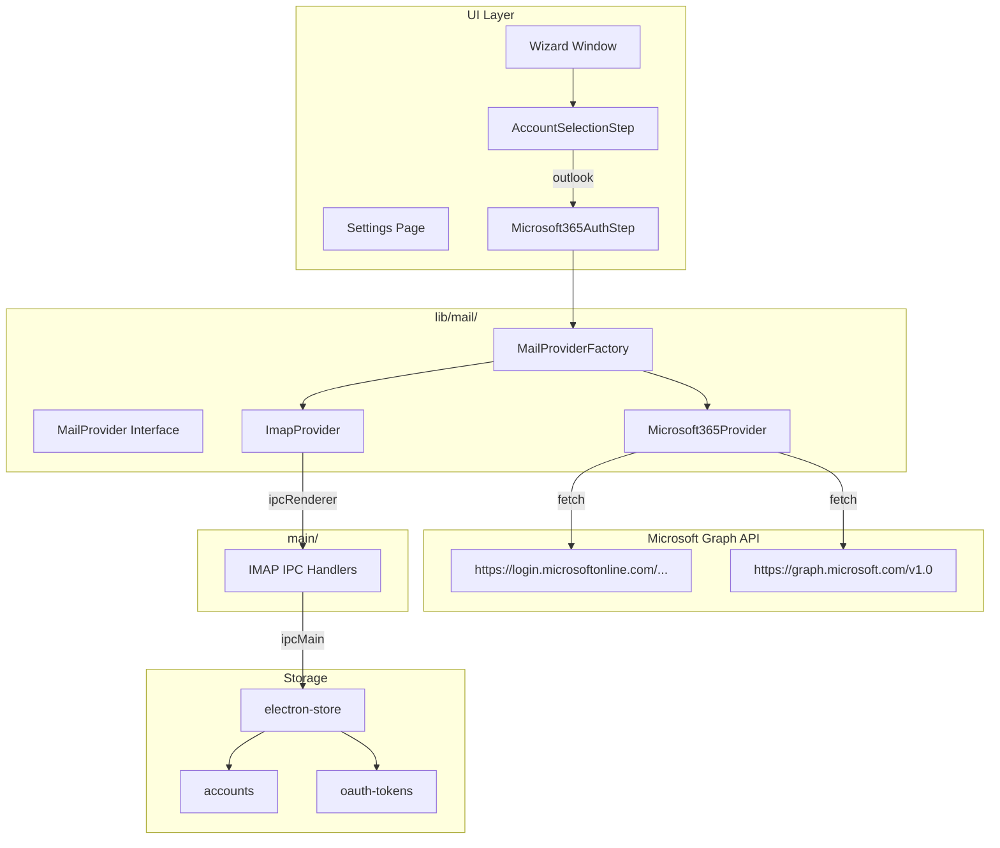

# Microsoft 365 Support Implementation Plan

## Overview

This plan outlines the implementation of Microsoft 365/Outlook support using Microsoft Graph API with OAuth2 Device Code Flow for authentication.

**Key Design Decision**: Microsoft 365 only requires HTTP calls, so it's implemented entirely in the Next.js layer. The `ImapProvider` is refactored to wrap IPC calls in a clean class. Both providers implement the same `MailProvider` interface.

## Architecture Diagram



## Azure AD App Registration Instructions

### Step 1: Access Azure Portal
1. Go to [Azure Portal](https://portal.azure.com)
2. Navigate to **Azure Active Directory** → **App registrations**
3. Click **New registration**

### Step 2: Register the Application
- **Name**: SpamBuster (or your preferred name)
- **Supported account types**: Accounts in any organizational directory (Multitenant)
- **Redirect URI**: Leave blank (Device Code Flow doesn't require it)

### Step 3: Note the Application ID
- After registration, copy the **Application (client) ID**
- This will be needed for configuration

### Step 4: Configure API Permissions
1. Click **API permissions** → **Add a permission**
2. Select **Microsoft Graph** → **Delegated permissions**
3. Add the following permissions:
   - `User.Read` - Sign in and read user profile
   - `Mail.Read` - Read user email
   - `Mail.ReadWrite` - Read and write user email (for moving to spam)
   - `offline_access` - Maintain access to data even when not actively using the app

### Step 5: Note the Tenant ID
- The tenant ID is used in the OAuth endpoints
- For multitenant apps, use `common`
- Or note your specific tenant ID from the Azure AD overview

## Implementation Steps

### Step 1: Update Types

**File: `lib/mail/types.ts`**
```typescript
// Add Microsoft 365 specific config type
export interface Microsoft365Config {
  clientId: string;
  tenantId: string;
  userEmail: string;
  accessToken: string;
  refreshToken?: string;
  tokenExpiry?: Date;
  spamFolder?: string;
}

// Extend MailConnectionConfig to support both IMAP and OAuth2
export interface MailConnectionConfig {
  // IMAP fields (for backward compatibility)
  host?: string;
  port?: number;
  secure?: boolean;
  username?: string;
  password?: string;
  allowUnsignedCertificate?: boolean;
  spamFolder?: string;
  // OAuth2 fields
  authType?: 'password' | 'oauth2';
  oauth2Config?: Microsoft365Config;
}

// Update MailProvider interface - all methods work with the unified config
export interface MailProvider {
  testConnection(config: MailConnectionConfig): Promise<TestConnectionResult>;
  fetchEmails(config: MailConnectionConfig, maxAgeDays: number): Promise<FetchEmailsResult>;
  moveEmailToSpam(config: MailConnectionConfig, emailId: string): Promise<MoveEmailResult>;
}

export type MailProviderType = 'imap' | 'gmail' | 'outlook';

export type AccountStatus = 'working' | 'trouble' | 'disabled';

export interface Account {
  id: string;
  type: MailProviderType;
  config: MailConnectionConfig;
  name?: string;
  status: AccountStatus;
}
```

### Step 2: Refactor ImapProvider (Wrap IPC calls)

**File: `lib/mail/imap.ts`**
```typescript
import { MailConnectionConfig, MailProvider, TestConnectionResult, FetchEmailsResult, MoveEmailResult } from './types';

export class ImapProvider implements MailProvider {
  async testConnection(config: MailConnectionConfig): Promise<TestConnectionResult> {
    if (typeof window !== 'undefined' && window.electronAPI) {
      try {
        const result = await window.electronAPI.invoke('test-imap-connection', config);
        return result as TestConnectionResult;
      } catch (error) {
        console.error('IMAP connection test failed:', error);
        return { success: false, error: error instanceof Error ? error.message : 'Connection failed' };
      }
    }
    return { success: false, error: 'Electron API not available' };
  }

  async fetchEmails(config: MailConnectionConfig, maxAgeDays: number): Promise<FetchEmailsResult> {
    if (typeof window !== 'undefined' && window.electronAPI) {
      try {
        const result = await window.electronAPI.invoke('fetch-emails', config, maxAgeDays);
        return result as FetchEmailsResult;
      } catch (error) {
        console.error('Failed to fetch emails:', error);
        return { success: false, error: error instanceof Error ? error.message : 'Failed to fetch emails' };
      }
    }
    return { success: false, error: 'Electron API not available' };
  }

  async moveEmailToSpam(config: MailConnectionConfig, emailId: string): Promise<MoveEmailResult> {
    if (typeof window !== 'undefined' && window.electronAPI) {
      try {
        const result = await window.electronAPI.invoke('move-email-to-spam', config, emailId);
        return result as MoveEmailResult;
      } catch (error) {
        console.error('Failed to move email to spam:', error);
        return { success: false, error: error instanceof Error ? error.message : 'Failed to move email to spam' };
      }
    }
    return { success: false, error: 'Electron API not available' };
  }
}
```

### Step 3: Create Microsoft365Provider (Uses fetch directly)

**File: `lib/mail/microsoft365.ts`**
```typescript
import { MailConnectionConfig, MailProvider, TestConnectionResult, FetchEmailsResult, MoveEmailResult, Microsoft365Config } from './types';

const DEVICE_CODE_ENDPOINT = 'https://login.microsoftonline.com/common/oauth2/v2.0/devicecode';
const TOKEN_ENDPOINT = 'https://login.microsoftonline.com/common/oauth2/v2.0/token';
const GRAPH_API = 'https://graph.microsoft.com/v1.0';
const SCOPES = ['User.Read', 'Mail.Read', 'Mail.ReadWrite', 'offline_access'];

export class Microsoft365Provider implements MailProvider {
  async initiateAuth(clientId: string, tenantId: string = 'common'): Promise<{
    userCode: string;
    deviceCode: string;
    verificationUri: string;
    expiresIn: number;
    message: string;
  }> {
    const response = await fetch(DEVICE_CODE_ENDPOINT, {
      method: 'POST',
      headers: { 'Content-Type': 'application/json' },
      body: JSON.stringify({
        client_id: clientId,
        scope: SCOPES.join(' '),
      }),
    });

    if (!response.ok) {
      throw new Error(`Failed to initiate auth: ${response.statusText}`);
    }

    return response.json();
  }

  async exchangeCodeForToken(
    clientId: string,
    tenantId: string,
    deviceCode: string
  ): Promise<{
    access_token: string;
    refresh_token: string;
    expires_in: number;
  }> {
    const response = await fetch(TOKEN_ENDPOINT, {
      method: 'POST',
      headers: { 'Content-Type': 'application/x-www-form-urlencoded' },
      body: new URLSearchParams({
        client_id: clientId,
        device_code: deviceCode,
        grant_type: 'urn:ietf:params:oauth:grant-type:device_code',
      }),
    });

    if (!response.ok) {
      const error = await response.json();
      throw new Error(error.error_description || 'Failed to exchange code for token');
    }

    return response.json();
  }

  async refreshAccessToken(
    clientId: string,
    tenantId: string,
    refreshToken: string
  ): Promise<{
    access_token: string;
    refresh_token: string;
    expires_in: number;
  }> {
    const response = await fetch(TOKEN_ENDPOINT, {
      method: 'POST',
      headers: { 'Content-Type': 'application/x-www-form-urlencoded' },
      body: new URLSearchParams({
        client_id: clientId,
        refresh_token: refreshToken,
        grant_type: 'refresh_token',
        scope: SCOPES.join(' '),
      }),
    });

    if (!response.ok) {
      throw new Error(`Failed to refresh token: ${response.statusText}`);
    }

    return response.json();
  }

  async testConnection(config: MailConnectionConfig): Promise<TestConnectionResult> {
    const oauthConfig = config.oauth2Config;
    if (!oauthConfig?.accessToken) {
      return { success: false, error: 'Not authenticated' };
    }

    try {
      const response = await fetch(`${GRAPH_API}/me`, {
        headers: { Authorization: `Bearer ${oauthConfig.accessToken}` },
      });
      return { success: response.ok };
    } catch (error) {
      return { success: false, error: error instanceof Error ? error.message : 'Connection failed' };
    }
  }

  async fetchEmails(config: MailConnectionConfig, maxAgeDays: number): Promise<FetchEmailsResult> {
    const oauthConfig = config.oauth2Config;
    if (!oauthConfig?.accessToken) {
      return { success: false, error: 'Not authenticated' };
    }

    try {
      // Calculate date filter
      const endDate = new Date();
      const startDate = new Date();
      startDate.setDate(endDate.getDate() - maxAgeDays);
      const filterDate = startDate.toISOString();

      const response = await fetch(
        `${GRAPH_API}/me/mailFolders/Inbox/messages?$filter=receivedDateTime ge '${filterDate}'&$select=id,subject,from,receivedDateTime,body,bodyPreview&$top=50`,
        {
          headers: { Authorization: `Bearer ${oauthConfig.accessToken}` },
        }
      );

      if (!response.ok) {
        // Try refreshing token if expired
        if (response.status === 401 && oauthConfig.refreshToken) {
          const tokenResponse = await this.refreshAccessToken(
            oauthConfig.clientId,
            oauthConfig.tenantId,
            oauthConfig.refreshToken
          );
          
          if (tokenResponse.access_token) {
            oauthConfig.accessToken = tokenResponse.access_token;
            oauthConfig.refreshToken = tokenResponse.refresh_token || oauthConfig.refreshToken;
            oauthConfig.tokenExpiry = new Date(Date.now() + tokenResponse.expires_in * 1000);
            
            // Retry request
            return this.fetchEmails(config, maxAgeDays);
          }
        }
        throw new Error(`Graph API error: ${response.status}`);
      }

      const data = await response.json();
      const emails = data.value.map((msg: any) => ({
        id: msg.id,
        subject: msg.subject,
        from: msg.from?.emailAddress?.address || 'Unknown',
        date: new Date(msg.receivedDateTime),
        body: msg.body?.content || msg.bodyPreview || '',
      }));

      return { success: true, emails };
    } catch (error) {
      return { success: false, error: error instanceof Error ? error.message : 'Failed to fetch emails' };
    }
  }

  async moveEmailToSpam(config: MailConnectionConfig, emailId: string): Promise<MoveEmailResult> {
    const oauthConfig = config.oauth2Config;
    if (!oauthConfig?.accessToken) {
      return { success: false, error: 'Not authenticated' };
    }

    try {
      // First, find the Junk/Spam folder ID
      const foldersResponse = await fetch(`${GRAPH_API}/me/mailFolders`, {
        headers: { Authorization: `Bearer ${oauthConfig.accessToken}` },
      });

      if (!foldersResponse.ok) {
        throw new Error('Failed to fetch mail folders');
      }

      const foldersData = await foldersResponse.json();
      const spamFolder = foldersData.value.find(
        (f: any) => f.displayName.toLowerCase() === 'junk email' || f.displayName.toLowerCase() === 'spam'
      );

      if (!spamFolder) {
        return { success: false, error: 'Spam folder not found' };
      }

      // Move the email to the spam folder
      const moveResponse = await fetch(
        `${GRAPH_API}/me/messages/${emailId}/move`,
        {
          method: 'POST',
          headers: {
            Authorization: `Bearer ${oauthConfig.accessToken}`,
            'Content-Type': 'application/json',
          },
          body: JSON.stringify({
            destinationId: spamFolder.id,
          }),
        }
      );

      if (!moveResponse.ok) {
        throw new Error(`Failed to move email: ${moveResponse.status}`);
      }

      return { success: true };
    } catch (error) {
      return { success: false, error: error instanceof Error ? error.message : 'Failed to move email to spam' };
    }
  }
}
```

### Step 4: Update Factory

**File: `lib/mail/factory.ts`**
```typescript
import { MailProvider, MailProviderType } from './types';
import { ImapProvider } from './imap';
import { Microsoft365Provider } from './microsoft365';

export class MailProviderFactory {
  static createProvider(type: MailProviderType): MailProvider {
    switch (type) {
      case 'imap':
        return new ImapProvider();
      case 'gmail':
        throw new Error('Gmail provider not implemented yet');
      case 'outlook':
        return new Microsoft365Provider();
      default:
        throw new Error(`Unknown mail provider type: ${type}`);
    }
  }
}
```

### Step 5: Update Index Export

**File: `lib/mail/index.ts`**
```typescript
export * from './types';
export * from './factory';
export * from './imap';
export * from './microsoft365';
```

### Step 6: Create Microsoft 365 Auth Step UI

**File: `app/wizard/steps/Microsoft365AuthStep.tsx`**
```typescript
"use client";

import { useState, useEffect } from 'react';
import { Card, CardContent, CardDescription, CardHeader, CardTitle } from "@/components/ui/card";
import { Button } from "@/components/ui/button";
import { Input } from "@/components/ui/input";
import { Label } from "@/components/ui/label";
import { AlertCircle, CheckCircle, ExternalLink, Loader2 } from 'lucide-react';
import { toast } from 'sonner';
import { Microsoft365Provider } from '@/lib/mail/microsoft365';

interface Microsoft365AuthStepProps {
  onBack?: () => void;
  onComplete?: (accountData: any) => void;
}

export function Microsoft365AuthStep({ onBack, onComplete }: Microsoft365AuthStepProps) {
  const [clientId, setClientId] = useState('');
  const [tenantId, setTenantId] = useState('common');
  const [step, setStep] = useState<'credentials' | 'authenticating' | 'success' | 'error'>('credentials');
  const [deviceCodeInfo, setDeviceCodeInfo] = useState<{
    userCode: string;
    deviceCode: string;
    verificationUri: string;
    message: string;
  } | null>(null);
  const [error, setError] = useState<string | null>(null);
  const [accountName, setAccountName] = useState('');
  const provider = new Microsoft365Provider();

  const handleInitiateAuth = async () => {
    if (!clientId) {
      toast.error('Please enter your Client ID');
      return;
    }

    setStep('authenticating');
    setError(null);

    try {
      const result = await provider.initiateAuth(clientId, tenantId);
      setDeviceCodeInfo({
        userCode: result.userCode,
        deviceCode: result.deviceCode,
        verificationUri: result.verificationUri,
        message: result.message,
      });
    } catch (err) {
      setError(err instanceof Error ? err.message : 'Failed to initiate authentication');
      setStep('error');
    }
  };

  const handlePollForToken = async () => {
    if (!deviceCodeInfo) return;

    try {
      const tokenResult = await provider.exchangeCodeForToken(
        clientId,
        tenantId,
        deviceCodeInfo.deviceCode
      );

      // Get user info
      const userResponse = await fetch('https://graph.microsoft.com/v1.0/me', {
        headers: { Authorization: `Bearer ${tokenResult.access_token}` },
      });
      const userInfo = await userResponse.json();

      const accountData = {
        type: 'outlook' as const,
        name: accountName || userInfo.displayName || userInfo.mail || userInfo.userPrincipalName,
        config: {
          authType: 'oauth2' as const,
          oauth2Config: {
            clientId,
            tenantId,
            userEmail: userInfo.mail || userInfo.userPrincipalName,
            accessToken: tokenResult.access_token,
            refreshToken: tokenResult.refresh_token,
            tokenExpiry: new Date(Date.now() + tokenResult.expires_in * 1000),
          },
        },
        status: 'working' as const,
      };

      // Save account via IPC
      const createdAccount = await window.electronAPI.accountsAPI.create(accountData);
      
      setStep('success');
      toast.success('Microsoft 365 account connected successfully!');
      
      setTimeout(() => {
        onComplete?.(createdAccount);
      }, 1500);
    } catch (err) {
      const errorMessage = err instanceof Error ? err.message : '';
      if (errorMessage.includes('authorization_pending')) {
        // Keep polling
        setTimeout(handlePollForToken, 5000);
      } else if (errorMessage.includes('expired_token')) {
        setError('Authentication expired. Please try again.');
        setStep('error');
      } else {
        setError(errorMessage || 'Authentication failed');
        setStep('error');
      }
    }
  };

  return (
    <div className="min-h-screen bg-background flex items-center justify-center p-4">
      <Card className="w-full max-w-md">
        <CardHeader className="text-center">
          <CardTitle className="text-2xl">Connect Microsoft 365</CardTitle>
          <CardDescription>
            Enter your Azure AD app credentials to connect your Outlook account
          </CardDescription>
        </CardHeader>
        <CardContent className="space-y-4">
          {step === 'credentials' && (
            <>
              <div className="space-y-2">
                <Label htmlFor="accountName">Account Name (optional)</Label>
                <Input
                  id="accountName"
                  placeholder="My Work Email"
                  value={accountName}
                  onChange={(e) => setAccountName(e.target.value)}
                />
              </div>
              <div className="space-y-2">
                <Label htmlFor="clientId">Application (Client) ID</Label>
                <Input
                  id="clientId"
                  placeholder="Enter your Azure AD Client ID"
                  value={clientId}
                  onChange={(e) => setClientId(e.target.value)}
                />
                <p className="text-xs text-muted-foreground">
                  Found in Azure Portal → Azure AD → App registrations → Your App → Application ID
                </p>
              </div>
              <div className="space-y-2">
                <Label htmlFor="tenantId">Tenant ID</Label>
                <Input
                  id="tenantId"
                  placeholder="common or your tenant ID"
                  value={tenantId}
                  onChange={(e) => setTenantId(e.target.value)}
                />
                <p className="text-xs text-muted-foreground">
                  Use "common" for multitenant apps, or your specific tenant ID
                </p>
              </div>
              <Button className="w-full" onClick={handleInitiateAuth}>
                Continue
              </Button>
              {onBack && (
                <Button className="w-full" variant="ghost" onClick={onBack}>
                  Back
                </Button>
              )}
            </>
          )}

          {step === 'authenticating' && !deviceCodeInfo && (
            <div className="text-center space-y-4">
              <Loader2 className="h-8 w-8 animate-spin mx-auto" />
              <p>Initiating authentication...</p>
            </div>
          )}

          {step === 'authenticating' && deviceCodeInfo && (
            <div className="text-center space-y-4">
              <p className="text-sm text-muted-foreground">{deviceCodeInfo.message}</p>
              
              <div className="p-4 border rounded-lg bg-muted">
                <p className="text-xs text-muted-foreground mb-2">Enter this code:</p>
                <p className="text-2xl font-mono font-bold tracking-wider">
                  {deviceCodeInfo.userCode}
                </p>
              </div>
              
              <Button
                className="w-full"
                variant="outline"
                onClick={() => window.electronAPI.shellAPI.openExternal(deviceCodeInfo.verificationUri)}
              >
                <ExternalLink className="h-4 w-4 mr-2" />
                Open microsoft.com/devicelogin
              </Button>
              
              <Button className="w-full" onClick={handlePollForToken}>
                I've entered the code
              </Button>
              {onBack && (
                <Button className="w-full" variant="ghost" onClick={onBack}>
                  Cancel
                </Button>
              )}
            </div>
          )}

          {step === 'success' && (
            <div className="text-center space-y-4">
              <CheckCircle className="h-8 w-8 text-green-500 mx-auto" />
              <p className="font-medium">Authentication successful!</p>
              <p className="text-sm text-muted-foreground">Redirecting...</p>
            </div>
          )}

          {step === 'error' && (
            <div className="text-center space-y-4">
              <AlertCircle className="h-8 w-8 text-red-500 mx-auto" />
              <p className="text-red-500">{error}</p>
              <Button className="w-full" onClick={() => setStep('credentials')}>
                Try Again
              </Button>
              {onBack && (
                <Button className="w-full" variant="ghost" onClick={onBack}>
                  Back
                </Button>
              )}
            </div>
          )}
        </CardContent>
      </Card>
    </div>
  );
}
```

### Step 7: Update AccountSelectionStep

**File: `app/wizard/steps/AccountSelectionStep.tsx`**
```typescript
// Remove disabled attribute from Outlook button
<Button 
  className="w-full" 
  variant="outline" 
  onClick={() => onAccountSelect?.('outlook')}
>
  <IconBrandWindows className="mr-2 h-4 w-4" />
  Add Microsoft 365/Outlook account
</Button>
```

### Step 8: Update Wizard Page

**File: `app/wizard/page.tsx`**
```typescript
import { AccountSelectionStep } from "./steps/AccountSelectionStep";
import { ImapSettingsStep } from "./steps/ImapSettingsStep";
import { AIConfigurationStep } from "./steps/AIConfigurationStep";
import { Microsoft365AuthStep } from "./steps/Microsoft365AuthStep";
// ... existing imports and code

// Add route handling for Microsoft365AuthStep
// In the render logic:
case 'microsoft365':
  return <Microsoft365AuthStep onBack={() => setStep('account')} onComplete={handleAccountComplete} />;
```

### Step 9: Create User Documentation

**File: `docs/microsoft365-setup.md`**
```markdown
# Microsoft 365 Setup Guide

## Prerequisites

- A Microsoft 365 account (work or school account)
- Access to Azure Active Directory admin center

## Step 1: Register Application in Azure AD

1. Go to [Azure Portal](https://portal.azure.com)
2. Navigate to **Azure Active Directory** → **App registrations**
3. Click **New registration**
4. Fill in:
   - **Name**: SpamBuster
   - **Supported account types**: Accounts in any organizational directory (Multitenant)
5. Click **Register**
6. Copy the **Application (client) ID** - you'll need this for the app

## Step 2: Configure API Permissions

1. Click **API permissions** → **Add a permission**
2. Select **Microsoft Graph** → **Delegated permissions**
3. Add:
   - `User.Read` - Sign in and read user profile
   - `Mail.Read` - Read user email
   - `Mail.ReadWrite` - Read and write user email
   - `offline_access` - Maintain access to data

## Step 3: Connect in SpamBuster

1. Open SpamBuster
2. Go to Settings → Mail Accounts
3. Click "Add Account"
4. Select "Microsoft 365/Outlook"
5. Enter your Application (Client) ID
6. Follow the device code authentication flow

## Troubleshooting

### "AADSTS" Errors
- Check that your app has the correct API permissions
- Ensure the user has consented to the permissions

### Token Expired
- The app will automatically refresh tokens when they expire
- If re-authentication is needed, use the "Re-authenticate" button in settings
```

## Files to Create/Modify Summary

| File | Action |
|------|--------|
| `lib/mail/types.ts` | Add Microsoft365Config and update types |
| `lib/mail/imap.ts` | Refactor to implement MailProvider interface (no code changes needed - already implements interface) |
| `lib/mail/microsoft365.ts` | Create new file with Microsoft365Provider class using fetch |
| `lib/mail/factory.ts` | Update to return Microsoft365Provider for 'outlook' |
| `lib/mail/index.ts` | Export new provider |
| `app/wizard/steps/Microsoft365AuthStep.tsx` | Create new auth UI component |
| `app/wizard/steps/AccountSelectionStep.tsx` | Enable Outlook button |
| `app/wizard/page.tsx` | Add route for Microsoft365AuthStep |
| `docs/microsoft365-setup.md` | Create user documentation |

## Benefits of This Architecture

1. **Clean Separation**: Microsoft365Provider uses pure HTTP (fetch), ImapProvider uses IPC
2. **Same Interface**: Both providers implement `MailProvider` interface identically
3. **Factory Pattern**: `MailProviderFactory.createProvider(type)` returns the appropriate provider
4. **No Unnecessary IPC**: Microsoft Graph API calls don't need to go through Electron main process
5. **Testability**: Both providers can be unit tested independently
